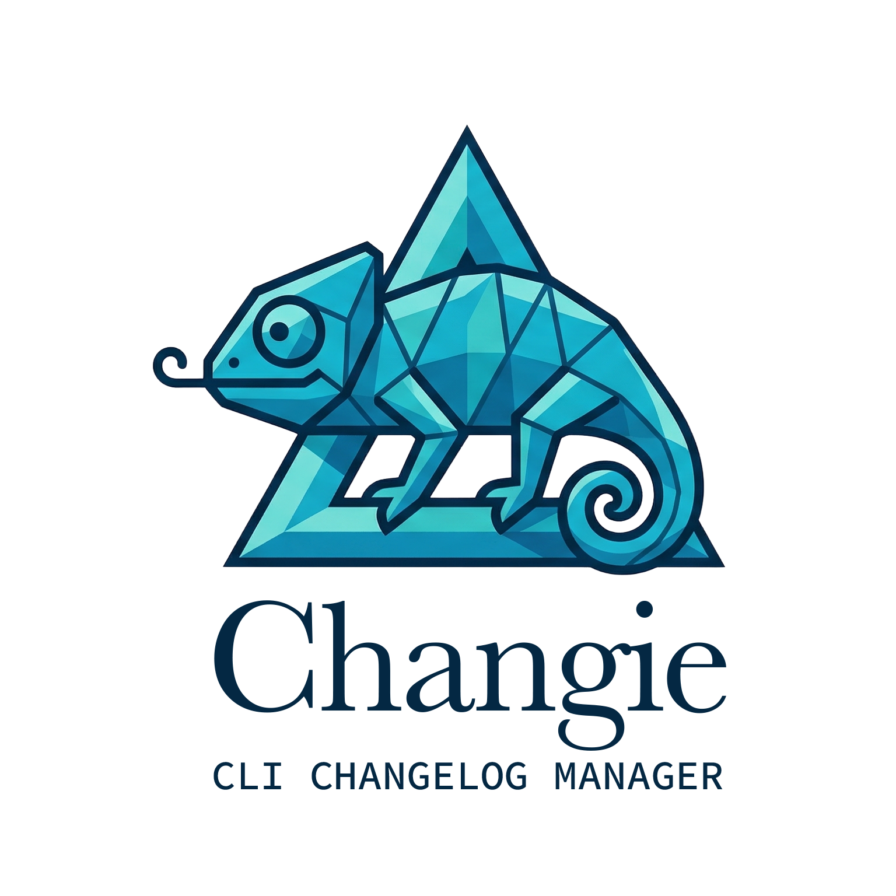

<p align="center">
  
</p>

# changie

[](https://github.com/peiman/changie/actions/workflows/ci.yml)
[](https://codecov.io/gh/peiman/changie)
[](https://goreportcard.com/report/github.com/peiman/changie)
[](https://github.com/peiman/changie/releases)
[](https://pkg.go.dev/github.com/peiman/changie)
[](LICENSE)
[](https://github.com/peiman/changie/security/code-scanning)
[](https://go.dev)

**changie** is a Go CLI for maintaining changelogs in the [Keep a Changelog](https://keepachangelog.com/en/1.1.0/) format and shipping releases with [Semantic Versioning](https://semver.org/). It handles the everyday workflow around `CHANGELOG.md`: initializing the file, adding entries to the correct section, validating structure, comparing releases, and cutting versioned releases from git tags.

## What changie does

- Initializes a changelog with an `Unreleased` section.
- Adds entries to `Added`, `Changed`, `Deprecated`, `Removed`, `Fixed`, and `Security`.
- Validates changelog structure, dates, duplicate entries, links, and version ordering.
- Shows the entries between two released versions.
- Bumps `major`, `minor`, or `patch`, updates the changelog, commits the release, tags it, and can optionally push it.

## Installation

### Install with Go

```bash
go install github.com/peiman/changie@latest
```

### Build from source

```bash
git clone https://github.com/peiman/changie.git
cd changie
task build
./changie --help
```

### Release binaries

Prebuilt artifacts are published on the [GitHub Releases](https://github.com/peiman/changie/releases) page.

## Quick start

Initialize a project, add entries under `Unreleased`, cut a release, and then validate the finished changelog:

```bash
# Create CHANGELOG.md and choose whether tags use a v-prefix.
changie init

# Add entries to the right Keep a Changelog section.
changie changelog added "Add support for release compare links"
changie changelog fixed "Avoid duplicate entries in Unreleased"

# Cut the next version.
changie bump patch

# Validate the finished changelog.
changie changelog validate
```

By default, `changie bump <major|minor|patch>` expects a clean git working tree and runs on `main` or `master`. It updates the changelog, creates a release commit, and tags the new version. Add `--auto-push` if you want changie to push the commit and tags immediately.

## Usage

### Initialize a changelog

```bash
changie init
changie init --file HISTORY.md
changie init --use-v-prefix=false
```

If git tags already exist, changie adopts the tag style it finds. In a fresh repository, it can set up the initial convention for you.

### Add changelog entries

```bash
changie changelog added "Introduce release notes diffing"
changie changelog changed "Improve release commit messaging"
changie changelog fixed "Handle malformed version headers gracefully"
changie changelog security "Document token handling for release automation"
```

Entries are added under `## [Unreleased]` and changie avoids inserting the same bullet twice in the same section.

### Validate a changelog

```bash
changie changelog validate
changie changelog validate --file HISTORY.md
```

Validation checks five common problems:

- invalid version headers
- duplicate entries within a section
- broken reference links
- released versions without dates
- versions that are out of semver order

This command is most useful once your changelog has release sections and comparison links in place.

### Compare two versions

```bash
changie diff 1.2.0 1.3.0
changie diff v1.2.0 v2.0.0
```

This prints the changelog entries between two versions so you can review what changed across a release range.

### Release a new version

```bash
changie bump patch
changie bump minor --auto-push
changie bump major --allow-any-branch
```

Release bumps follow this workflow:

1. confirm git is available
2. confirm the branch is allowed
3. confirm the working tree is clean
4. determine the current version from the latest git tag
5. update `CHANGELOG.md`
6. create a release commit
7. create a git tag
8. optionally push the commit and tags

changie also updates changelog comparison links using your git remote when it can detect repository information.

## Configuration

changie reads configuration with the following precedence:

1. command-line flags
2. environment variables prefixed with `CHANGIE_`
3. configuration file
4. built-in defaults

### Config file locations

By default, changie looks for configuration in these locations:

- `./config.yaml`
- `~/.config/changie/config.yaml`

You can override this with `--config`, or change lookup behavior with `--config-path-mode xdg|native|both`.

### Example configuration

```yaml
app:
  changelog:
    file: CHANGELOG.md
    repository_provider: github
  version:
    use_v_prefix: true
  output_format: text
```

### Example environment variables

```bash
export CHANGIE_APP_CHANGELOG_FILE=CHANGELOG.md
export CHANGIE_APP_CHANGELOG_REPOSITORY_PROVIDER=github
export CHANGIE_APP_VERSION_USE_V_PREFIX=true
export CHANGIE_APP_OUTPUT_FORMAT=text
```

### Helpful config-related commands

```bash
# Validate a config file
changie config validate
changie config validate --file ./config.yaml
```

## Contributing

Contributions are welcome. If you want to work on changie:

```bash
git clone https://github.com/peiman/changie.git
cd changie
task setup
task test
task check
```

Before opening a pull request, make sure the full quality gate passes with `task check`. Please also follow the project's [Code of Conduct](CODE_OF_CONDUCT.md).

## License

changie is released under the [MIT License](LICENSE).
